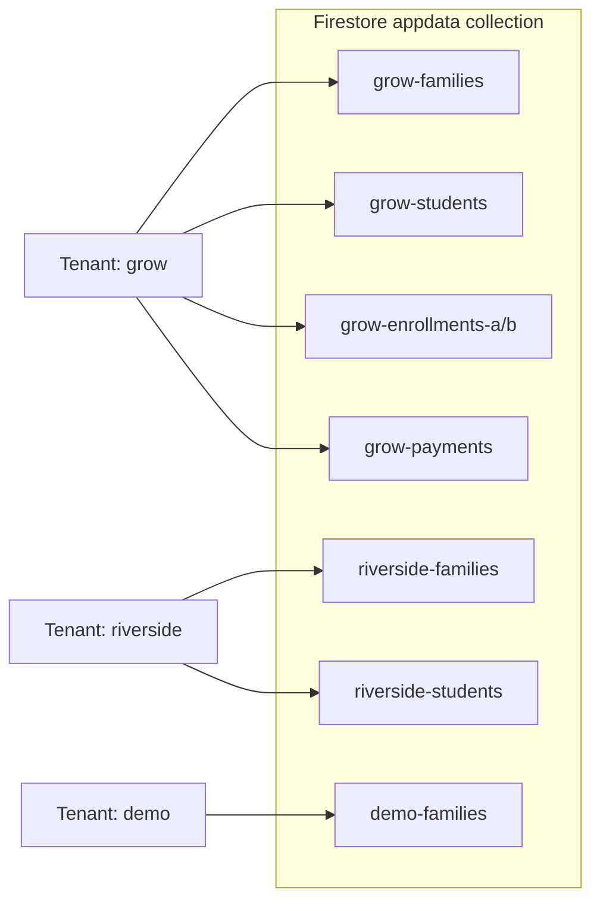

# Microschool Ledger — Architecture

**Last updated:** March 2026

---

## System Diagram


### Multi-tenant data isolation



### Auth → permissions matrix

| Sign-in method | Who | Firestore write | Admin UI | Portal UI |
|---|---|---|---|---|
| `google.com` | School admins | Yes | Yes | No |
| `anonymous` | Demo visitors | Yes (demo slug only) | Yes | No |
| `emailLink` | Families | **No** (rules block it) | No | Yes |

---

## Overview

Microschool Ledger (`msledger`) is a multi-tenant financial management platform for microschools and homeschool co-ops. Each tenant gets its own isolated Firestore data partition, routed by subdomain or org slug.

- **Firebase project:** `msledger-a2525`
- **Live app:** https://msledger-a2525.web.app
- **GitHub repo:** https://github.com/rajeeva2000/msledger

---

## File Structure

```
msledger/
├── src/
│   ├── main.jsx            # React entry point (9 lines)
│   ├── App.jsx             # All React components (~13,400 lines)
│   ├── firebase.js         # Firebase init, multi-tenant storage API (~120 lines)
│   └── index.css           # Global styles
├── calculations.js         # Pure financial logic (no React/Firebase deps)
├── index.html              # HTML shell (Vite entry; 24 lines)
├── vite.config.js          # Vite build config
├── tailwind.config.js      # Tailwind custom colors + font
├── postcss.config.js       # PostCSS config
├── package.json            # npm dependencies + build/test scripts
├── firebase.json           # Firebase Hosting config (serves from dist/)
├── firestore.rules         # Firestore security rules
├── deploy.sh               # Manual production deploy script
├── CLAUDE.md               # Session context and architectural invariants
├── CHANGELOG.md            # Version history and roadmap
├── demo/
│   └── seed.html           # Standalone tool to populate a Firebase project with demo data
├── dist/                   # Vite build output (deployed to Firebase Hosting)
├── docs/                   # Developer documentation (this directory)
└── tests/
    └── calculations.test.js  # Jest unit tests for calculations.js
```

---

## Tech Stack

| Layer | Technology | Notes |
|-------|-----------|-------|
| UI framework | React 18 (npm) | JSX compiled by Vite at build time |
| Styling | Tailwind CSS (npm) | Utility classes; custom `grow-*` color palette |
| Icons | Lucide React (npm) | Accessed via `_mkIcon(name)` shim for consistent usage |
| Spreadsheet export | SheetJS / XLSX (npm) | Family ledger, enrollment detail, payment logs |
| Database | Firebase Firestore (compat SDK) | Single `appdata` collection; slug-prefixed document keys for tenant isolation |
| Hosting | Firebase Hosting | CDN delivery; all routes rewrite to `index.html`; serves from `dist/` |
| Auth | Firebase Auth (compat SDK) | Google OAuth for admins; anonymous auth for demo mode; **email link (passwordless) for family portal** |
| Unit tests | Jest (Node.js) | Tests only `calculations.js` |
| Build | Vite | Output to `dist/`; CI runs `npm run build` before deploy |

---

## Application Entry Point

Vite builds `src/main.jsx`, which renders the top-level `App` component into `<div id="root">` in `index.html`.

`App` determines which UI to show based on Firebase Auth state and the URL:

| Condition | UI rendered |
|-----------|------------|
| Loading auth state | Spinner |
| Not authenticated + `?view=portal` in URL | `ParentPortalLogin` |
| Not authenticated | Admin login screen (Google + Demo) |
| Authenticated via email link | `FamilyPortalDashboard` |
| Authenticated via Google / anonymous | `GrowERP` (admin app) |

---

## Multi-Tenant Architecture

### Tenant routing

On load, `firebase.js` reads an org slug from (in priority order):
1. The `?org=` URL query parameter
2. The first subdomain segment (e.g. `grow.microschoolledger.com`)
3. A hardcoded fallback (`grow`)

The resolved slug is exported as `TENANT_SLUG` and used by all Firestore reads and writes.

### Tenant registry

```js
export const TENANT_REGISTRY = [
  { slug: 'grow', name: 'The Grow Co-op', firestoreProject: 'grow-erp-8765c' }
];
```

Each entry may point to a different Firebase project (for legacy tenants migrated from another project) or to the default `msledger-a2525` project.

### Firestore partitioning

All data lives in a single collection — **`appdata`** — in `msledger-a2525`. Documents are keyed with the org slug prefix:

```
grow-families
grow-students
grow-enrollments-a / grow-enrollments-b
grow-payments
grow-programs
grow-pricing-rules
...
```

No data ever crosses tenant boundaries because each Firestore document key is unique to its slug.

### Super-user role

`rarora2005@gmail.com` is hardcoded as the platform super-user. This user:
- Bypasses the tenant access list check (cannot be locked out)
- Gets full `canEdit` access to any tenant's data
- Sees platform-level tooling in Setup → Tools: Tenant Data Audit and cross-project migration

### Demo mode

Anonymous users can sign into a `demo` tenant via Firebase anonymous auth. On first visit, the app auto-seeds realistic data (7 families, 11 students, 17 enrollments, 40+ payments). Demo data is isolated under the `demo` slug and does not affect any real tenant.

---

## Authentication

The app supports three Firebase Auth sign-in methods:

### Google OAuth (admin users)
Standard Google sign-in popup. Users must also be in the tenant's `{slug}-access-list` to access data (enforced client-side). Admins can read and write all `appdata` and `tenants` documents — enforced by Firestore rules checking `sign_in_provider == 'google.com'`.

### Anonymous auth (demo mode)
`auth.signInAnonymously()` is called when the user clicks "Explore Demo". The app switches the tenant slug to `demo` and auto-seeds data. Anonymous users can read and write (to the demo partition only — they cannot access real tenant data because they'd need to know the slug and have it on the access list).

### Email link / passwordless (family portal)
`auth.sendSignInLinkToEmail(email, actionCodeSettings)` sends a sign-in link to a family's email. When the family clicks the link, `auth.signInWithEmailLink(email, url)` completes the sign-in — no password is ever set or needed. The sign-in provider is `emailLink`.

**Firestore rules enforce that `emailLink` users are read-only** — they can read `appdata` (to load their family's data) but cannot write. This is a database-level restriction independent of the UI.

Portal users are identified in the `App` component by checking that their `providerData` contains no `google.com` provider.

---

## State Architecture

All application state lives in the `GrowERP` root component (admin app) or `FamilyPortalDashboard` (portal). There is no Redux, Context API, or Zustand — just `useState` hooks at the top level with props drilled down to children.

### Admin app core data state

| State variable | Type | Firestore key (template) |
|----------------|------|--------------------------|
| `families` | `Family[]` | `{slug}-families` |
| `students` | `Student[]` | `{slug}-students` |
| `enrollments` | `Enrollment[]` | merged from `{slug}-enrollments-a` + `{slug}-enrollments-b` |
| `payments` | `Payment[]` | `{slug}-payments` |
| `stepUpPayments` | `StepUpPayment[]` | `{slug}-stepup-payments` |
| `programs` | `Program[]` | `{slug}-programs` |
| `pricingRules` | `PricingRule[]` | `{slug}-pricing-rules` |
| `expenses` | `Expense[]` | `{slug}-expenses` |
| `expenseCategories` | `Category[]` | `{slug}-expense-categories` |
| `invoices` | `Invoice[]` | `{slug}-invoices` |
| `charges` | `Charge[]` | `{slug}-charges` (missing document → empty array; Grow-safe) |
| `accessList` | `AccessEntry[]` | `{slug}-access-list` |
| `auditLog` | `AuditEntry[]` | `{slug}-audit-log` |

### Portal data loading

`FamilyPortalDashboard` loads its data independently on mount:
1. Reads `{slug}-families` and finds the family where `family.portalEmail` matches `currentUser.email`
2. If no match → shows "Not Registered" error
3. If match → reads students, enrollments (both `-a` and `-b`), payments, StepUp payments, programs, **and charges** in parallel
4. Filters all collections to the matched family only before rendering
5. Passes `charges` (filtered to the family) into both `computeFamilyBalances` and `InvoiceModal`
6. Loads tenant config from the `tenants/{slug}` Firestore collection (non-blocking)

---

## Data Loading (admin app)

On mount, `GrowERP` reads all collections from Firestore via the `storage` adapter.

Load sequence:
1. Resolve org slug from URL
2. Read `{slug}-access-list` → determine role for current user
3. Read all data collections in parallel
4. Read `{slug}-migrations-applied` → diff against `DATA_MIGRATIONS` array
5. If pending migrations affect records, pause and show migration confirmation UI
6. If migrations approved (or no-ops), mark them applied and call `setLoading(false)`

---

## Auto-Save

All writes to Firestore happen via a single debounced `useEffect` watching every data state variable. The debounce window is **800ms** — any state change resets the timer, so a burst of edits produces a single Firestore write once things settle.

**Enrollment compaction:** Before saving, enrollments are compacted (field names shortened, `monthlyCharges` converted to an ordered array) to reduce Firestore document size. The split between `{slug}-enrollments-a` and `{slug}-enrollments-b` is recalculated on every save.

---

## Firestore Security Rules

```
match /appdata/{key} {
  allow read:  if request.auth != null;
  allow write: if request.auth != null &&
    request.auth.token.firebase.sign_in_provider in ['google.com', 'anonymous'];
}

match /tenants/{slug} {
  allow read:  if request.auth != null;
  allow write: if request.auth != null &&
    request.auth.token.firebase.sign_in_provider in ['google.com', 'anonymous'];
}
```

Key properties:
- Any authenticated user can **read** `appdata` — this allows portal users to load their family's data
- Only Google OAuth or anonymous (admin / demo) users can **write** — email-link portal users are read-only at the database level
- Legacy `users/{userId}/` path still allows per-user access for backward compatibility

---

## Migration System

`DATA_MIGRATIONS` is a constant array in `App.jsx`. Each migration has:

| Field | Type | Purpose |
|-------|------|---------|
| `id` | string | Unique ID tracked in `{slug}-migrations-applied` |
| `title` | string | Short description shown in confirmation dialog |
| `description` | string | Longer explanation of what changes |
| `preview(data)` | function | Returns `{ entityType: count }` of affected records |
| `migrate(data)` | function | Pure function: takes all data, returns updated data |

**Safety rules:**
- Migrations must be idempotent — re-running is a no-op on already-correct records
- Migrations touching `monthlyCharges` are high-risk; run `npx jest` before shipping
- If a migration would compute `deposit = 0` (missing `depositPct`), it must skip that record

---

## Audit Log

Every create, update, and delete action calls `writeAudit(action, entity, before, after)`. The audit log is stored in `{slug}-audit-log` and viewable in Setup → Audit Log. Entries include: action type, entity type, before/after state, user email, and timestamp.

---

## Session Tracking

Login and logout events are written to the audit log. A 5-minute heartbeat is written to `{slug}-session-heartbeat`. On the next login, if the heartbeat is older than 10 minutes, an implicit logout is inferred and recorded.

---

## CI/CD

Two GitHub Actions workflows in `.github/workflows/`:

| Workflow | Trigger | What it does |
|----------|---------|--------------|
| `firebase-hosting-pull-request.yml` | PR opened/updated | Runs `npm ci && npm run build && npm test --ci`; posts test results as PR comment; deploys to a **preview URL** |
| `firebase-hosting-merge.yml` | Push to `main` | Runs `npm run build`; deploys to **production** (`msledger-a2525.web.app`) |

Both workflows use the `FIREBASE_SERVICE_ACCOUNT_MSLEDGER_A2525` GitHub secret.

---

## Deployment

**Automated (recommended):** Merge to `main` — GitHub Actions builds and deploys to production.

**Manual fallback:**
```bash
./deploy.sh   # stamps commit + timestamp, commits, pushes, deploys
```

**Running tests:**
```bash
cd /home/user/msledger
npx jest
```

Tests cover `calcDeposit`, `buildMonthlyCharges`, and `computeFamilyBalances`. Run after any change to `calculations.js` or migration logic.
