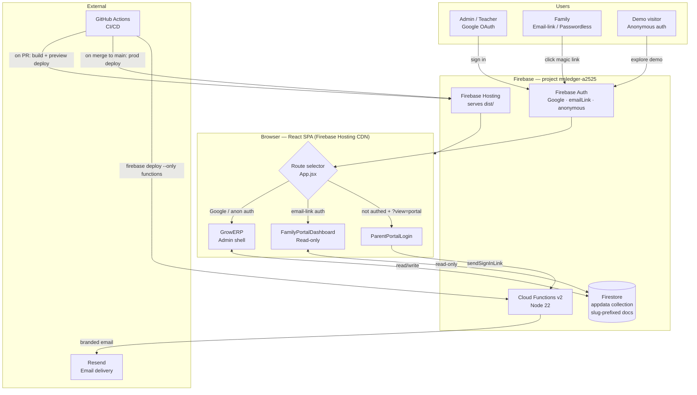
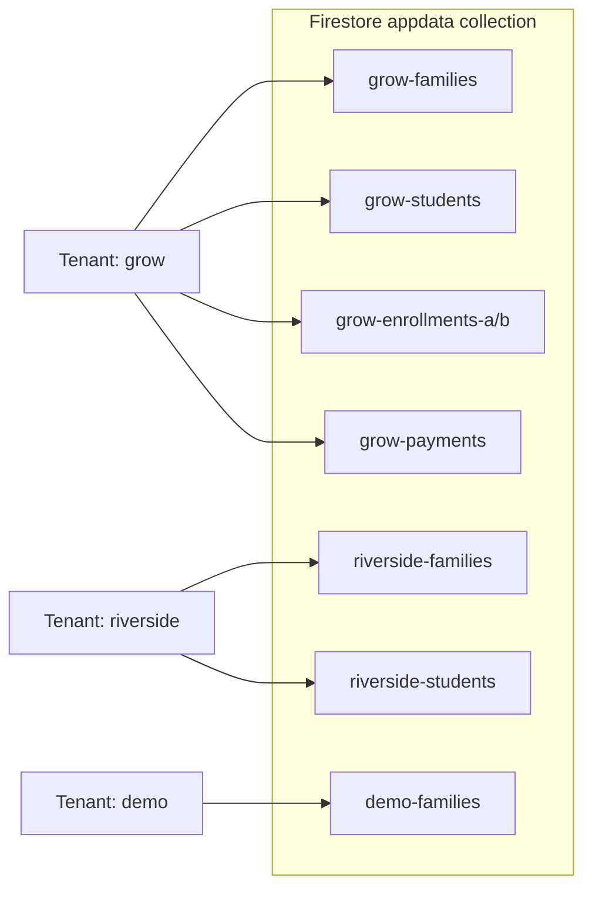

# Microschool Ledger — Architecture

**Last updated:** April 2026

---

## System Diagram



### Multi-tenant data isolation



### Auth → permissions matrix

| Sign-in method | Who | Firestore write | Admin UI | Portal UI |
|---|---|---|---|---|
| `google.com` | School admins | Yes | Yes | No |
| `anonymous` | Demo visitors | Yes (demo slug only) | Yes | No |
| `emailLink` | Families | **No** (rules block it) | No | Yes |

---

## Overview

Microschool Ledger (`msledger`) is a multi-tenant financial management platform for microschools and homeschool co-ops. Each tenant gets its own isolated Firestore data partition, routed by subdomain or org slug.

- **Firebase project:** `msledger-a2525`
- **Live app:** https://msledger-a2525.web.app
- **GitHub repo:** https://github.com/rajeeva2000/msledger

---

## File Structure

```
msledger/
├── src/
│   ├── main.jsx            # React entry point (9 lines)
│   ├── App.jsx             # All React components (~13,400 lines)
│   ├── firebase.js         # Firebase init, multi-tenant storage API (~120 lines)
│   └── index.css           # Global styles
├── calculations.js         # Pure financial logic (no React/Firebase deps)
├── index.html              # HTML shell (Vite entry; 24 lines)
├── vite.config.js          # Vite build config
├── tailwind.config.js      # Tailwind custom colors + font
├── postcss.config.js       # PostCSS config
├── package.json            # npm dependencies + build/test scripts
├── firebase.json           # Firebase Hosting config (serves from dist/)
├── firestore.rules         # Firestore security rules
├── deploy.sh               # Manual production deploy script
├── CLAUDE.md               # Session context and architectural invariants
├── CHANGELOG.md            # Version history and roadmap
├── demo/
│   └── seed.html           # Standalone tool to populate a Firebase project with demo data
├── dist/                   # Vite build output (deployed to Firebase Hosting)
├── docs/                   # Developer documentation (this directory)
└── tests/
    └── calculations.test.js  # Jest unit tests for calculations.js
```

---

## Tech Stack

| Layer | Technology | Notes |
|-------|-----------|-------|
| UI framework | React 18 (npm) | JSX compiled by Vite at build time |
| Styling | Tailwind CSS (npm) | Utility classes; custom `grow-*` color palette |
| Icons | Lucide React (npm) | Accessed via `_mkIcon(name)` shim for consistent usage |
| Spreadsheet export | SheetJS / XLSX (npm) | Family ledger, enrollment detail, payment logs |
| Database | Firebase Firestore (compat SDK) | Single `appdata` collection; slug-prefixed document keys for tenant isolation |
| Hosting | Firebase Hosting | CDN delivery; all routes rewrite to `index.html`; serves from `dist/` |
| Auth | Firebase Auth (compat SDK) | Google OAuth for admins; anonymous auth for demo mode; **email link (passwordless) for family portal** |
| Unit tests | Jest (Node.js) | 100 tests covering `calculations.js` and security invariants |
| Build | Vite | Output to `dist/`; CI runs `npm run build` before deploy |

---

## Application Entry Point

Vite builds `src/main.jsx`, which renders the top-level `App` component into `<div id="root">` in `index.html`.

`App` determines which UI to show based on Firebase Auth state and the URL:

| Condition | UI rendered |
|-----------|------------|
| Loading auth state | Spinner |
| Not authenticated + `?view=portal` in URL | `ParentPortalLogin` |
| Not authenticated | Admin login screen (Google + Demo) |
| Authenticated via email link | `FamilyPortalDashboard` |
| Authenticated via Google / anonymous | `GrowERP` (admin app) |

---

## Multi-Tenant Architecture

### Tenant routing

On load, `firebase.js` reads an org slug from (in priority order):
1. The `?org=` URL query parameter
2. The first subdomain segment (e.g. `grow.microschoolledger.com`)
3. A hardcoded fallback (`grow`)

The resolved slug is exported as `TENANT_SLUG` and used by all Firestore reads and writes.

### Tenant registry

```js
export const TENANT_REGISTRY = [
  { slug: 'grow', name: 'The Grow Co-op', firestoreProject: 'grow-erp-8765c' }
];
```

Each entry may point to a different Firebase project (for legacy tenants migrated from another project) or to the default `msledger-a2525` project.

### Firestore partitioning

All data lives in a single collection — **`appdata`** — in `msledger-a2525`. Documents are keyed with the org slug prefix:

```
grow-families
grow-students
grow-enrollments-a / grow-enrollments-b
grow-payments
grow-programs
grow-pricing-rules
...
```

No data ever crosses tenant boundaries because each Firestore document key is unique to its slug.

### Super-user role

`rarora2005@gmail.com` is the platform super-user. Identity is verified in two layers:

1. **Firebase custom claim** `{ superuser: true }` — set server-side by `grantTenantAccess` via Admin SDK on first super-user login. Firestore rules check `request.auth.token.superuser == true` (email is retained as a fallback during claim propagation).
2. **Email string check** — used in Cloud Functions (trusted Admin SDK context) as the primary guard for super-user-only callables.

Custom claims can only be written server-side (Admin SDK), making them harder to spoof than email alone. This user:
- Bypasses the tenant access list check (cannot be locked out)
- Gets full `canEdit` access to any tenant's data
- Sees platform-level tooling in Setup → Tools: Tenant Data Audit and cross-project migration

### Demo mode

Anonymous users can sign into a `demo` tenant via Firebase anonymous auth. On first visit, the app auto-seeds realistic data (7 families, 11 students, 17 enrollments, 40+ payments). Demo data is isolated under the `demo` slug and does not affect any real tenant.

---

## Authentication

The app supports three Firebase Auth sign-in methods:

### Google OAuth (admin users)
Standard Google sign-in popup. On sign-in, the app calls the `grantTenantAccess` Cloud Function, which checks `{slug}-access-list` and (if found) writes `userTenants/{uid}.slugs[slug] = true` via Admin SDK. Firestore rules verify this grant on every read and write — the UI access check is just a UX layer.

### Anonymous auth (demo mode)
`auth.signInAnonymously()` is called when the user clicks "Explore Demo". The app switches the tenant slug to `demo` and auto-seeds data. Firestore rules explicitly allow anonymous users to read and write only `demo-*` and `e2etest-*` documents.

### Email link / passwordless (family portal)
The `sendSignInLink` Cloud Function generates a Firebase sign-in link and delivers it via Resend. Before generating the link it:
1. Pre-validates that the email is registered in `{slug}-families` — unregistered addresses silently return success (no enumeration)
2. Enforces a 5-minute per-address rate limit keyed by SHA-256(email) in `signInRateLimit` collection

When the family clicks the link, `auth.signInWithEmailLink` completes sign-in. The app then calls `requestPortalAccess` which verifies the email against the families list and writes `userTenants/{uid}.slugs[slug] = 'portal'` via Admin SDK.

**Firestore rules enforce portal users are read-only and limited to an explicit allowlist of documents** (`families`, `students`, `enrollments-a/b`, `payments`, `stepup-payments`, `programs`, `charges`, `invoices`). Admin-only docs (`expenses`, `audit-log`, `pricing-rules`, `access-list`, `reminder-queue`) are never readable by portal users.

### `userTenants/{uid}` — the access grant

All Firestore access is gated on a server-written `userTenants/{uid}` document:

| Slug grant value | Meaning | Written by |
|-----------------|---------|-----------|
| `true` | Full admin (read + write) | `grantTenantAccess` on Google login |
| `'viewer'` | Read-only admin | `grantTenantAccess` for viewer-role users |
| `'portal'` | Family portal (allowlisted docs, no write) | `requestPortalAccess` after email-link sign-in |
| missing | No access | Default |

Only Admin SDK (Cloud Functions) can write `userTenants` — clients cannot self-grant access.

---

## State Architecture

All application state lives in the `GrowERP` root component (admin app) or `FamilyPortalDashboard` (portal). There is no Redux, Context API, or Zustand — just `useState` hooks at the top level with props drilled down to children.

### Admin app core data state

| State variable | Type | Firestore key (template) |
|----------------|------|--------------------------|
| `families` | `Family[]` | `{slug}-families` |
| `students` | `Student[]` | `{slug}-students` |
| `enrollments` | `Enrollment[]` | merged from `{slug}-enrollments-a` + `{slug}-enrollments-b` |
| `payments` | `Payment[]` | `{slug}-payments` |
| `stepUpPayments` | `StepUpPayment[]` | `{slug}-stepup-payments` |
| `programs` | `Program[]` | `{slug}-programs` |
| `pricingRules` | `PricingRule[]` | `{slug}-pricing-rules` |
| `expenses` | `Expense[]` | `{slug}-expenses` |
| `expenseCategories` | `Category[]` | `{slug}-expense-categories` |
| `invoices` | `Invoice[]` | `{slug}-invoices` |
| `charges` | `Charge[]` | `{slug}-charges` (missing document → empty array; Grow-safe) |
| `accessList` | `AccessEntry[]` | `{slug}-access-list` |
| `auditLog` | `AuditEntry[]` | `{slug}-audit-log` |

### Portal data loading

`FamilyPortalDashboard` loads its data independently on mount:
1. Reads `{slug}-families` and finds the family where `family.portalEmail` matches `currentUser.email`
2. If no match → shows "Not Registered" error
3. If match → reads students, enrollments (both `-a` and `-b`), payments, StepUp payments, programs, **and charges** in parallel
4. Filters all collections to the matched family only before rendering
5. Passes `charges` (filtered to the family) into both `computeFamilyBalances` and `InvoiceModal`
6. Loads tenant config from the `tenants/{slug}` Firestore collection (non-blocking)

---

## Data Loading (admin app)

On mount, `GrowERP` reads all collections from Firestore via the `storage` adapter.

Load sequence:
1. Resolve org slug from URL
2. Read `{slug}-access-list` → determine role for current user
3. Read all data collections in parallel
4. Read `{slug}-migrations-applied` → diff against `DATA_MIGRATIONS` array
5. If pending migrations affect records, pause and show migration confirmation UI
6. If migrations approved (or no-ops), mark them applied and call `setLoading(false)`

---

## Auto-Save

All writes to Firestore happen via a single debounced `useEffect` watching every data state variable. The debounce window is **800ms** — any state change resets the timer, so a burst of edits produces a single Firestore write once things settle.

**Enrollment compaction:** Before saving, enrollments are compacted (field names shortened, `monthlyCharges` converted to an ordered array) to reduce Firestore document size. The split between `{slug}-enrollments-a` and `{slug}-enrollments-b` is recalculated on every save.

Compact field mapping:

| Full field | Compact key | Notes |
|---|---|---|
| `studentId` | `si` | null for adult-type program enrollments |
| `familyId` | `fi` | present for adult-type programs (no `studentId`) |
| `programId` | `pi` | |
| `schoolYear` | `yr` | |
| `term` | `tm` | present for short-term enrollments; absent for annual |
| `status` | `st` | |
| `startDate / endDate / endType` | `sd / ed / et` | |
| `planId` | `pl` | absent for short-term enrollments |
| `monthlyCharges['enrollment-reserve']` | `er` | 0 for short-term |
| `monthlyCharges[june…may]` | `mc[0…11]` | ordered 12-element array |
| unknown `monthlyCharges` keys (term IDs) | `xmc` | `{ [termId]: amount }`; present only for short-term enrollments |

The `xmc` field preserves flat term charges (e.g. `{ 'fall-2026': 200 }`) that would otherwise be silently lost since `mc` only stores the 12 standard calendar months. On expand, `xmc` is merged back into `monthlyCharges`.

---

## Firestore Security Rules

Four collections with distinct access tiers:

### `appdata/{key}` — all tenant data

```
allow read:  if userHasKeyAccess(key) || userHasViewerAccess(key) || userHasPortalReadAccess(key);
allow write: if (isGoogleAuth() || isAnonymous()) && userHasKeyAccess(key);
```

- **`userHasKeyAccess`** — `userTenants/{uid}.slugs[slug] === true` (full admin grant)
- **`userHasViewerAccess`** — `userTenants/{uid}.slugs[slug] === 'viewer'`
- **`userHasPortalReadAccess`** — `userTenants/{uid}.slugs[slug] === 'portal'` AND `isPortalReadableDoc(key)`
- Portal allowlist (`isPortalReadableDoc`): `families`, `students`, `enrollments-a`, `enrollments-b`, `payments`, `stepup-payments`, `programs`, `charges`, `invoices` — checked via `key.matches('[^-]+-{docname}')` (not string split, which is unreliable in emulator)

### `tenants/{slug}` — public tenant config

```
allow read:  if true;   // publicly readable for SchoolFinder slug validation
allow write: if isGoogleAuth() && (isSuperUser() || slugs[slug] == true);
```

Contains only public branding fields: `name`, `logoUrl`, `address`, `contactEmail`, `invoiceTitle`, `paymentInstructions`, `replyToEmail`. **`ownerEmail` is NOT stored here** — see `tenantSecrets` below.

### `tenantSecrets/{slug}` — private tenant fields

```
allow read:  if isSuperUser() || slugs[slug] == true;
allow write: if isSuperUser();
```

Stores `ownerEmail` and any other fields that must not be publicly readable. Only full admins and the super-user can read; only the super-user can write.

### `signInRateLimit/{emailHash}` — sign-in rate limiting

```
allow read, write: if false;
```

Written exclusively by the `sendSignInLink` Cloud Function via Admin SDK. Keys are SHA-256(email) — no PII stored. All client access explicitly denied.

### `userTenants/{uid}` — access grants

```
allow read:  if request.auth.uid == uid;
allow write: if isSuperUser();
```

Only Cloud Functions (Admin SDK, bypasses rules) and the super-user write here. Users can read their own grant doc to know their access level.

### `isSuperUser()` — identity check

```js
function isSuperUser() {
  return request.auth.token.superuser == true ||       // custom claim (primary)
         request.auth.token.email == 'rarora2005@gmail.com';  // email fallback
}
```

Custom claim is set by `grantTenantAccess` on super-user login. Email fallback retained until the claim propagates.

---

## Migration System

`DATA_MIGRATIONS` is a constant array in `App.jsx`. Each migration has:

| Field | Type | Purpose |
|-------|------|---------|
| `id` | string | Unique ID tracked in `{slug}-migrations-applied` |
| `title` | string | Short description shown in confirmation dialog |
| `description` | string | Longer explanation of what changes |
| `preview(data)` | function | Returns `{ entityType: count }` of affected records |
| `migrate(data)` | function | Pure function: takes all data, returns updated data |

**Safety rules:**
- Migrations must be idempotent — re-running is a no-op on already-correct records
- Migrations touching `monthlyCharges` are high-risk; run `npx jest` before shipping
- If a migration would compute `deposit = 0` (missing `depositPct`), it must skip that record

---

## Audit Log

Every create, update, and delete action calls `writeAudit(action, entity, detail)`. The audit log is stored in `{slug}-audit-log` and viewable in Setup → Audit Log. Entries include: action type, entity type, detail object, user email, and timestamp.

The Setup → Audit Log view supports filtering by action type (IMPORT / CREATE / UPDATE / DELETE / LOGIN) and entity topic (stepup / payment / family / student / enrollment / …) via pill buttons; the counter shows "N matching of M events".

**StepUp import detail** — each `IMPORT / stepup` audit entry includes:
- `count` — number of new payments added
- `updated` — number of existing records updated with missing fields
- `skipped` — object mapping status name → count for rows skipped because `Status ≠ "paid"` (e.g. `{ "Authorized": 2 }`)

This powers the Home dashboard StepUp import overdue card: if the most recent `IMPORT / stepup` entry is ≥ 7 days old, an amber action item appears with a direct "Import Now" shortcut. If `skipped` is non-empty, the card shows how many pending payments may have since cleared.

---

## Session Tracking

Login and logout events are written to the audit log. A 5-minute heartbeat is written to `{slug}-session-heartbeat`. On the next login, if the heartbeat is older than 10 minutes, an implicit logout is inferred and recorded.

---

## CI/CD

Two GitHub Actions workflows in `.github/workflows/`:

| Workflow | Trigger | What it does |
|----------|---------|--------------|
| `firebase-hosting-pull-request.yml` | PR opened/updated | Runs Jest unit tests + Playwright E2E tests against Firebase emulator; posts pass/fail summary as PR comment; deploys to a **preview URL** |
| `firebase-hosting-merge.yml` | Push to `main` | Runs `npm run build`; deploys to **production** (`msledger-a2525.web.app`) |
| `deploy-functions-manual.yml` | Manual dispatch | Deploys Cloud Functions only (use when `functions/` changes don't accompany a code PR) |

Both hosting workflows use the `FIREBASE_SERVICE_ACCOUNT_MSLEDGER_A2525` GitHub secret.

**Playwright artifact policy** — the Playwright HTML report is uploaded as a GitHub Actions artifact **only on workflow failure** (not on every run). All previous `playwright-report` artifacts are deleted before uploading to avoid hitting GitHub's artifact storage quota. Retention is 2 days.

---

## Deployment

**Automated (recommended):** Merge to `main` — GitHub Actions builds and deploys to production.

**Manual fallback:**
```bash
./deploy.sh   # stamps commit + timestamp, commits, pushes, deploys
```

**Running tests:**
```bash
cd /home/user/msledger
npx jest
```

100 tests covering `calcDeposit`, `buildMonthlyCharges`, `computeFamilyBalances`, `buildInvoicePrefix`, `getInvoiceNumber`, `isValidSlug`, auto-save guard invariants, reminder eligibility helpers, and portal grant security rules. Run after any change to `calculations.js` or migration logic.
